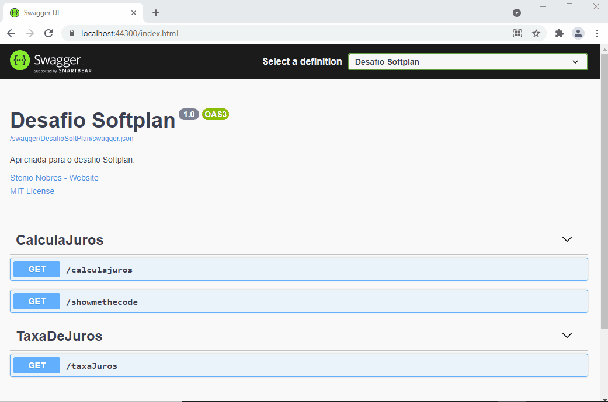

# Desafio Softplan

Aplicação ASP.NET Core criada com o principal objetivo de prover uma API básica de cálculo de juros compostos. O projeto contempla o uso de testes unitários, de integração e do Swagger para documentação.

## Pré-requisitos

O que precisa ser instalado na máquina para estender e depurar o projeto:

    Visual Studio Community 2019 ou superior;
    Net Core SDK 3.1 ou superior;

## Arquitetura

A solução está dividida em quatro projetos: DesafioSoftPlan.Api, DesafioSoftPlan.Negocio, DesafioSoftPlan.TestesDeIntegracao e DesafioSoftPlan.TestesUnitarios.

* **DesafioSoftPlan.Api**: projeto desenvolvido usando ASP.NET Core Web API e tem a responsabilidade de ser a camada de API da solução. Possui referência para o projeto `Negocio` onde se encontram as regras para cálculo dos juros compostos. O Swagger foi configurado nessa camada para documentação dos endpoints. Principais classes: **CalculaJurosController.cs** e **TaxaDeJurosController.cs**.

* **DesafioSoftPlan.Negocio**: projeto do tipo .NET Core class library onde as regras de cálculo de juros compostos estão definidas. Principal classe: **JurosCompostos.cs**.

* **DesafioSoftPlan.TestesDeIntegracao**: projeto do tipo .NET Core class library em que um teste de integração foi criado para validar o endpoint de cálculo de juros compostos. Possui referência para o projeto `Api`. Principal classe: **CalculaJurosTest.cs**.

* **DesafioSoftPlan.TestesUnitarios**: projeto do tipo .NET Core class library que utiliza o `NUnit` para criação dos testes unitários que validam a classe de negócio que calcula os juros compostos. Possui referência para o projeto `Negocio`. Principal classe: **JurosCompostosTest.cs**.
